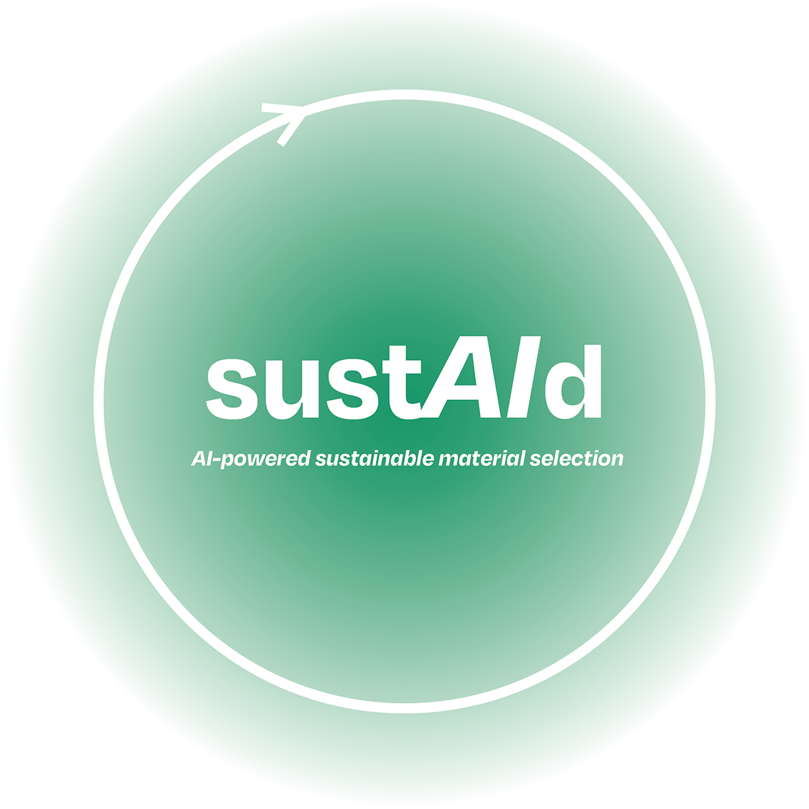

# sustAId - AI-Powered Sustainable Material Selection

**Version 0.1.0** - Professional Platform for Fashion Sustainability



## 🌱 About

**sustAId** is a professional web application designed for sustainability experts in the fashion industry. It provides intelligent tools to analyze, compare, and select sustainable materials based on comprehensive environmental, social, and economic metrics.

### Key Features

- 🔐 **Secure Access** - Invite-only platform for verified professionals
- 📊 **Material Database** - Comprehensive database of sustainable materials with detailed metrics
- 📈 **Interactive Visualizations** - Dynamic charts (Bar, Scatter, Radar, Pie) for data analysis
- 🤖 **AI Assistant** - Intelligent chatbot for material recommendations and insights
- 💾 **Data Management** - Import/export materials via CSV or SQL files
- 📁 **Export Capabilities** - Download charts as PNG or PDF for reports
- ✅ **Data Validation** - Automatic quality checks and missing data warnings

## 🚀 Quick Start

### Prerequisites

- **Node.js** 16.x or higher
- **npm** 8.x or higher
- **Supabase Account** (for backend services)

### Installation

1. **Clone the repository**
   ```bash
   git clone <repository-url>
   cd gino
   ```

2. **Install dependencies**
   ```bash
   npm install
   ```

3. **Configure environment variables**
   ```bash
   cp .env.example .env
   ```

4. **Add your Supabase credentials to `.env`**
   ```env
VITE_SUPABASE_URL=your_supabase_project_url
VITE_SUPABASE_ANON_KEY=your_supabase_anon_key
VITE_SUPABASE_SCHEMA=public
VITE_SUPABASE_TABLE=materials
   ```

   Get these values from your [Supabase Dashboard](https://app.supabase.com) → Project Settings → API

5. **Start the development server**
   ```bash
   npm run dev
   ```

6. **Open your browser**
   
   Navigate to [http://localhost:5173](http://localhost:5173)

## 📋 Available Scripts

### Development

```bash
npm run dev
```
Starts the Vite development server at `http://localhost:5173`  
Hot-reload enabled - changes appear instantly

### Build

```bash
npm run build
```
Creates an optimized production build in the `dist/` folder  
Minified and ready for deployment

### Preview

```bash
npm run preview
```
Preview the production build locally before deployment

## 🏗️ Tech Stack

| Technology | Version | Purpose |
|------------|---------|---------|
| **React** | 19.1.1 | UI framework |
| **Vite** | 7.1.3 | Build tool & dev server |
| **Tailwind CSS** | 3.4.19 | Styling |
| **Supabase** | 2.74.0 | Backend & authentication |
| **Recharts** | 3.2.1 | Data visualization |
| **Lucide React** | 0.544.0 | Icons |
| **jsPDF** | 3.0.3 | PDF export |
| **html2canvas** | 1.4.1 | Chart screenshots |
| **PapaParse** | 5.5.3 | CSV parsing |

## 📁 Project Structure

See `ARCHITECTURE.md` for a concise overview of responsibilities and flow.

```
gino/
├── public/              # Static assets
├── src/
│   ├── components/      # React components
│   │   ├── auth/       # Authentication components
│   │   ├── common/     # Shared UI components
│   │   ├── modals/     # Modal dialogs
│   │   └── views/      # Main view components
│   ├── App.jsx         # Main application component
│   ├── App.css         # Application styles
│   ├── index.jsx       # Entry point
│   ├── index.css       # Global styles
│   └── supabaseClient.js  # Supabase configuration
├── .env                # Environment variables (not in git)
├── .env.example        # Environment template
├── package.json        # Dependencies
├── vite.config.js      # Vite configuration
├── tailwind.config.js  # Tailwind configuration
└── README.md           # This file
```

## 🔐 Authentication & Access

sustAId uses **invite-only access** to ensure the platform is used by verified sustainability professionals.

### Sign Up (Request Access)

1. Click **"Request Access"** on the homepage
2. Enter your email and create a password
3. Provide a valid **invite code** (obtain from platform administrator)
4. Access is granted immediately upon validation

### Sign In

1. Click **"Sign In"** on the homepage
2. Enter your registered email and password
3. Access the full platform features

## 📊 Using the Platform

### 1. Material Database

Upon login, the app automatically loads a comprehensive database of sustainable materials from Supabase, including:

- Environmental metrics (GHG emissions, water consumption, energy use)
- Social sustainability indicators
- Physical properties (durability, strength, resistance)
- Economic data (cost range, volatility)
- Data sources and references

### 2. Importing Custom Data

You can upload your own material data:

1. Click **"Upload CSV/SQL"**
2. Select a CSV or SQL file
3. Preview and validate the data
4. Confirm import

**Required CSV columns:**
- `Material Name` or `Material ID` (required)
- `Category` (required)
- Additional metrics: `GHG Emissions`, `Water Consumption`, `Sustainability Score`, etc.

### 3. Data Visualization

Create interactive charts to analyze materials:

- **Bar Chart** - Compare metrics across materials
- **Scatter Plot** - Explore correlations between two variables
- **Radar Chart** - Multi-dimensional material profiles
- **Pie Chart** - Category distribution

Export charts as **PNG** or **PDF** for reports.

### 4. AI Assistant

Ask questions about your materials:
- "Which materials have the lowest carbon footprint?"
- "Show me materials with high durability and low water usage"
- "What are the best options for category X?"

## 🌐 Deployment

### Vercel (Recommended)

The project is configured for Vercel deployment:

```bash
npm run build
vercel --prod
```

See [`vercel.json`](./vercel.json) for configuration details.

### Other Platforms

Build the production bundle:

```bash
npm run build
```

Deploy the `dist/` folder to any static hosting service (Netlify, GitHub Pages, AWS S3, etc.)

## 🔧 Configuration

### Supabase Setup

1. Create a Supabase project at [app.supabase.com](https://app.supabase.com)
2. Create a `materials` table with the required schema
3. Set up authentication with email/password
4. Create an RPC function `check_invite_code` for invite validation
5. Add your credentials to `.env`

See [`SETUP.md`](./SETUP.md) for detailed backend configuration.

## 🐛 Troubleshooting

### App won't start
- Verify Node.js version: `node --version` (should be 16+)
- Clear node_modules: `rm -rf node_modules && npm install`
- Check for port conflicts (default: 5173)

### Supabase connection errors
- Verify `.env` file exists and contains valid credentials
- Check Supabase project is active
- Ensure RLS policies allow access

### Import CSV fails
- Verify file is UTF-8 encoded
- Check required columns are present
- Ensure no special characters in column names

### Charts won't export
- Check browser permissions for downloads
- Try a different export format (PNG vs PDF)
- Ensure sufficient disk space

## 📝 License

© 2025 Alessia Vittori - All rights reserved

Developed by [Alessia Vittori](mailto:info@sustaid.net)

## 🤝 Contributing

This is a private professional platform. For access or collaboration inquiries, contact [info@sustaid.net](mailto:info@sustaid.net).

## 📚 Additional Documentation

- [`SETUP.md`](./SETUP.md) - Detailed setup and security guidelines
- [`README-DISTRIBUZIONE.md`](./README-DISTRIBUZIONE.md) - Distribution and desktop app guide (Italian)
- [`AI_ASSISTANT_BUTTON_NOTES.txt`](./AI_ASSISTANT_BUTTON_NOTES.txt) - AI assistant implementation notes

---

**Built with ❤️ for sustainable fashion**
